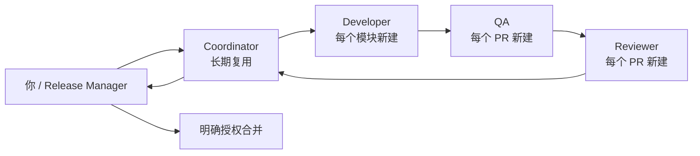

# 初学者开发进度导航

这个目录不是代码计划，而是你的操作手册：告诉你此刻应该打开哪个 Codex 任务、是否新建任务、该任务担任什么角色、你需要检查什么、什么时候必须停下，以及什么时候才允许合并。

在本文中：

- “任务”就是 Codex 侧边栏中的一个独立 task/chat。
- “窗口”表示一个独立任务，不要求真的打开多个桌面窗口。
- “当前任务”指 `CURRENT_STEP.md` 指定的唯一下一步。
- “完成”只表示当前原子步骤有证据，不表示整个模块完成。

## 工作模式

本仓库当前采用 `AUTONOMOUS_DELIVERY_MODE`。Coordinator 可在已批准 Issue、允许路径和既定合同内自动派发独立 Developer、QA、Reviewer，执行测试、返工、CI 复验、PR、squash merge 与进度更新。

- 每个生产 PR 仍必须保持 Developer、独立 QA、独立 Reviewer、merge executor 的角色分离；失败后回原 Developer，并使用新的 QA/Reviewer 复验。
- 同一问题连续两轮返工未解决时暂停并报告用户。
- 设备/系统修改、真实 APK/账号/数据、风险或登录异常、合同变更、破坏性操作、费用和外部发布仍须暂停，获得单独授权。
- 进度卡现在是证据清单而非每个 checkbox 的人工停点；Coordinator 必须在每个里程碑更新它。
- 用户可随时要求暂停或切回 `LEARNING_MODE`。

## 你需要保留哪些任务

- **Coordinator**：整个项目保留一个长期任务。每个 Wave 开始、每个 PR 准备合并、每次阻塞或回滚时回到这里。
- **Developer**：模块变化时必须新建。修复同一 PR 的问题时返回原 Developer，不要新建第二个 Developer。
- **QA**：Developer 停止并有可测试提交/PR 后新建。只独立测试和报告，不修生产代码。
- **Reviewer**：QA 通过后新建。只读审查，不一边审查一边修改。
- **你**：决定是否接受步骤、是否授权 Git 操作、是否合并、是否切换到并行模式。

## 新建任务前：先同步，不靠聊天记忆

不同 task 的 worktree 不会自动看到 Coordinator 本地未提交的文件，也不会自动拥有之前聊天的上下文。因此每次新建 Developer、QA 或 Reviewer 前，Coordinator 必须：

1. 把这次任务需要的进度、治理决定、合同或 handoff 文档先 `commit` 并 `push` 到共享仓库；不得只留在 Coordinator 工作区。
2. 不直接 push 到 `main`：按已授权方式使用协调分支/PR，或确认这些变更已合并到远端 `main`。
3. 记录新任务应从哪个远端 SHA 开始；新任务的第一段交接必须写明角色、Issue、允许路径、依赖、验收证据和停止条件。
4. 如果同步所需的 commit/push/PR 尚未得到用户授权，先停在 Coordinator，不要带着过期状态新开窗口。

这样 GitHub 仓库，而不是某个本地 worktree 或聊天记忆，才是每个新任务可复现的共同起点。

## 阅读顺序

1. `CURRENT_STEP.md`：现在只看这一页。
2. `00-window-and-role-rules.md`：第一次操作前读一遍。
3. `01-governance-baseline.md`：把当前未提交的治理文档安全放入 Git。
4. `02-standard-module-loop.md`：每个模块都重复的 17 个小步骤。
5. 当前模块文件：查看 Issue、依赖和该模块的逐项清单。
6. 遇到失败时读 `13-rollback-and-recovery.md`。
7. 需要开新任务时从 `14-copy-paste-prompts.md` 复制提示词。

## 文件索引

| 文件 | 用途 |
| --- | --- |
| `CURRENT_STEP.md` | 唯一当前步骤和下一窗口 |
| `PROGRESS.md` | 全项目人工进度板 |
| `00-window-and-role-rules.md` | 什么时候新开、复用或关闭任务 |
| `01-governance-baseline.md` | 当前文档进入 Git 的准备阶段 |
| `02-standard-module-loop.md` | 每个模块重复的最小交付循环 |
| `03-w0-foundation.md` | Issue #1 / MOD-00 |
| `04-w1-environment.md` | Issue #2 / MOD-01 |
| `05-w1-jobs.md` | Issue #3 / MOD-04 |
| `06-w1-evidence.md` | Issue #4 / MOD-05 |
| `07-w1-export.md` | Issue #5 / MOD-06 |
| `08-w2-protocol.md` | Issue #6 / MOD-02 |
| `09-w3-frida-agent.md` | Issue #7 / MOD-03 |
| `10-w4-integration.md` | Issue #8 / MOD-07 |
| `11-w5-qa-portability.md` | Issue #9 / MOD-08 |
| `12-w6-full-run.md` | Issue #10 / 正式全量运行 |
| `13-rollback-and-recovery.md` | 失败、返工、回滚和紧急停止 |
| `14-copy-paste-prompts.md` | 各角色开场提示词 |

## 如何前进一步

在 `LEARNING_MODE`，完成当前原子步骤后不要直接执行下一项。回到 Coordinator，提供：

- 当前步骤 ID；
- 实际完成了什么；
- 文件、commit、PR、CI 或测试证据；
- 是否存在失败和未解决问题；
- 你是否同意进入下一步。

在 `LEARNING_MODE`，Coordinator 只能做以下其中一件事：

1. 证明当前步骤未完成，并让你停留；
2. 建议进入一个明确的下一步骤；
3. 发现 GitHub 与本地记录冲突并暂停；
4. 在你明确批准后更新 `CURRENT_STEP.md` 和 `PROGRESS.md`。

在 `AUTONOMOUS_DELIVERY_MODE`，Coordinator 按已批准 Issue 自动完成这些里程碑，但仍会在 QA/Review 失败、敏感操作或连续两轮返工时暂停。

## 当前节奏

`LEARNING_MODE` 下默认是串行学习模式：

- 一次只运行一个 Developer；
- QA 和 Reviewer 在 Developer 停止后依次进行；
- W1 虽然技术上允许四个模块并行，但学习模式按 `MOD-01 → MOD-04 → MOD-05 → MOD-06` 顺序体验完整流程；
- 只有你明确修改 `CURRENT_STEP.md` 中的模式，Coordinator 才能改变并行策略；无论哪种模式都不绕过依赖门。

Codex 会在新任务启动时读取根目录 `AGENTS.md`。因此新任务必须在本项目目录/Project 中创建；如果任务早于 `AGENTS.md` 创建，建议关闭后新建，避免使用旧上下文。
